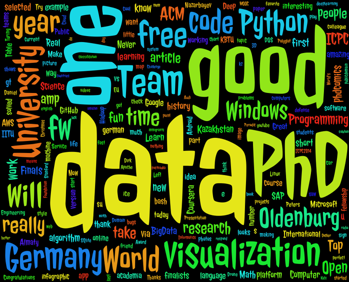
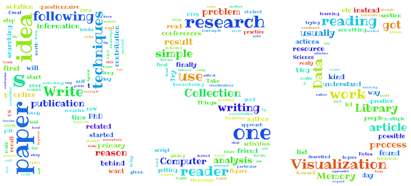
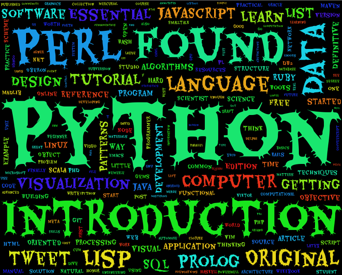
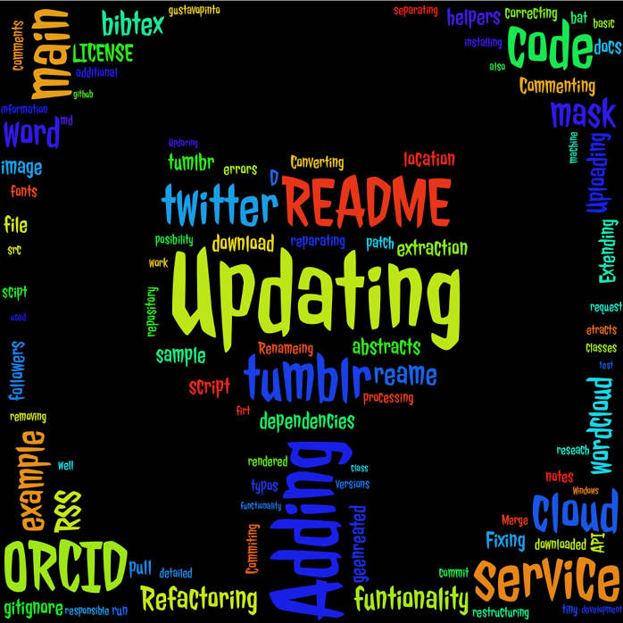

### About

Tiny python utility that converts data crawled from different services into cloud of words. Utility represents collection of the different python scripts. Folder [services](services) contains the services supported with their more detailed description (installation, usage, etc.). Folder [services-to-wordcloud](services-to-wordcloud) contains the list of python scripts that are taking data acquired from particular service and transform data into  cloud of word.

### Supported Services so Far

* [Twitter](https://twitter.com/)
* [ORCID](http://orcid.org/)
* [RSS](http://en.wikipedia.org/wiki/RSS)
* [Tumblr](https://www.tumblr.com/)
* [GitHub](https://github.com/)
* [Habrahabr](http://habrahabr.ru/)

### Examples

**Twitter Timeline**

<center>
    
    
</center>

**ORCID (publications abstracts)**

<center>
    
</center>

**RSS Blog**

<center>
    
</center>

**Tumblr Text Blogs**

<center>
    
</center>

**GitHub Commits**

<center>
    
</center>

### Installation

**NOTE** This section lists only the main dependencies of the "services-to-wordcloud". Dependencies of the each service are described inside *READMEs* services's own [services folders](services).

Use 'pip' to install dependencies
```
pip install pyprind
pip install numpy
pip install matplotlib
pip install pandas
pip install scipy
```

Or use 'conda' from [Anaconda Scientific Python Distribution](https://store.continuum.io/cshop/anaconda/) to install dependencies (*better solutions in case you are new to python or Windows user*):
```
conda install matplotlib
conda install pyprind
conda install numpy
conda install pandas
conda install scipy
```

If you are not able to find package *'by default'* with ```'conda'```, please use 'binstar' to find proper binary of the package.
For example for 'twitter' looks as follows:
```
binstar search -t conda twitter
```

Installing [wordcloud](https://github.com/amueller/word_cloud) python package can be very tricky

```
conda install pil
pip install git+git://github.com/amueller/word_cloud.git
```

In case you really need to compile a python package on Windows, do not use MinGW, it won't work. Because the official compiler for the Python on Windows is *Microsoft Visual C++ Compiler*. If you already have Visual Studio installed on your PC, that you can execute the following command based on the version of Visual Studio installed (for me it was a case when needed to install Python package in ```virtualenv``` folder):

* Visual Studio 2010 (VS10): ```SET VS90COMNTOOLS=%VS100COMNTOOLS%```
* Visual Studio 2012 (VS11): ```SET VS90COMNTOOLS=%VS110COMNTOOLS%```
* Visual Studio 2013 (VS12): ```SET VS90COMNTOOLS=%VS120COMNTOOLS%```

You can also use patch for your Windows, that can be found [here](http://www.microsoft.com/en-us/download/details.aspx?id=44266). After installing specific compiler for Python 2.7 on Windows, you also will need to upgrade your setuptools:
```
pip install --upgrade setuptools
```

However, if you are fan of the MinGW and it's already installed and used as a "default" C and C++ compiler on your Windows machine, on the moment of the Python package compilation (while intalling [wordcloud](https://github.com/amueller/word_cloud)) is better to remove it from your %PATH% variable.

If above mentioned advises didn't work for you, here are some more detailed answers on various AMA services, reddit and various blogs:
* [Microsoft Visual C++ Compiler for Python 2.7](http://stackoverflow.com/questions/26140192/microsoft-visual-c-compiler-for-python-2-7)
* [error: Unable to find vcvarsall.bat](http://stackoverflow.com/questions/2817869/error-unable-to-find-vcvarsall-bat)
* [What are some things every Python developer should know for developing on Windows?](https://www.reddit.com/r/Python/comments/3anuxz/what_are_some_things_every_python_developer/)

More on Windows and Python you can find in article [How to deal with the pain of "unable to find vcvarsall.bat"](https://blogs.msdn.microsoft.com/pythonengineering/2016/04/11/unable-to-find-vcvarsall-bat/).

### Credits

* Inspired by the article [Turn Your Twitter Timeline into a Word Cloud Using Python](http://sebastianraschka.com/Articles/2014_twitter_wordcloud.html#A.-Downloading-Your-Twitter-Timeline-Tweets) written by [@rasbt](https://github.com/rasbt)
* Fonts are taken from the various of places and initially distributed by the authors under one of the open licenses.
	- A huge collection of fonts can be found in the [googlefontdirectory github repository](https://github.com/w0ng/googlefontdirectory).
	- Another collection of fonts by [fontsquirrel](http://www.fontsquirrel.com/fonts/)
* Russian stopwords are taken from [stop-words](https://code.google.com/p/stop-words/)


### Author

* [Viktor Dmitriyev](https://github.com/vdmitriyev)

###  License

The MIT License (MIT). For details check [license](LICENSE) file.
