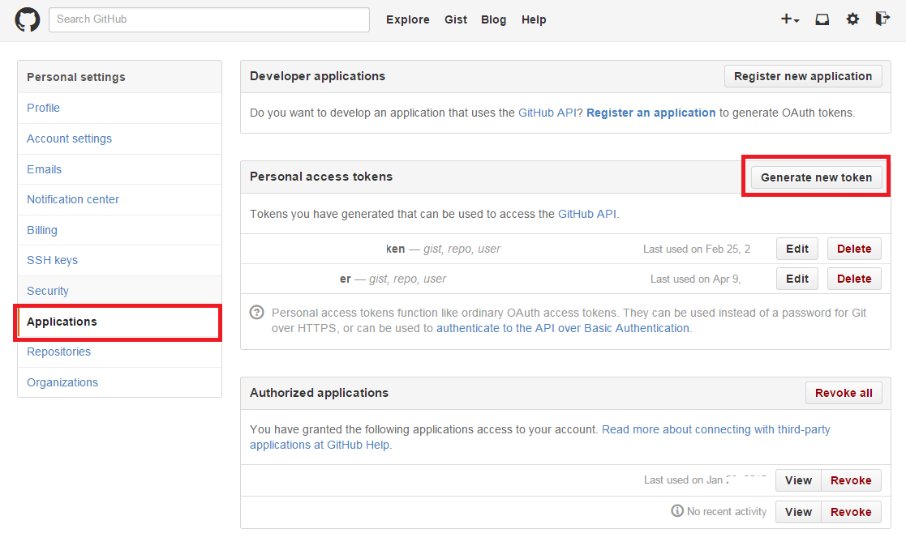
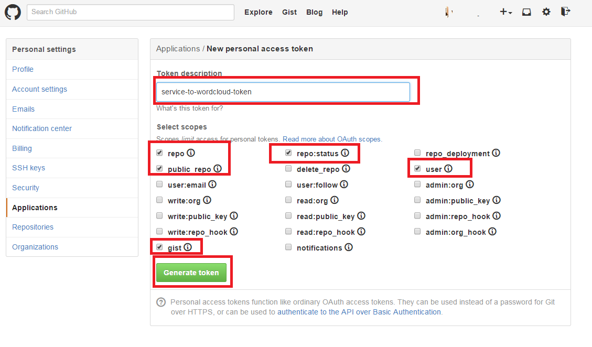
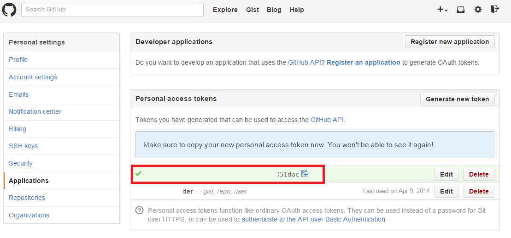

### About 

Tiny python utility that downloads text messages of your commits from particular Github repository and then stores them in CSV format.

### Install

**NOTE** github api wrapper installation is already shiped with the "services-to-wordcloud". Install only dependencies of it (see the section *Dependencies*).

Or use pip to install both dependencies
```
pip install git+https://github.com/michaelliao/githubpy.git
pip install pandas
```

### Dependencies

* [githubpy](git+https://github.com/michaelliao/githubpy.git)
* pandas

### GitHub Tokens

For the basic usage create file ```oauth_info.py``` with following filled GitHub credentials.

**NOTE** that the *PERSONAL_ACCESS_TOKEN* can be easily generated in the GitHub settings using fuctionality on the panel ```Applications```.

```
# single dedicated to one person token
PERSONAL_ACCESS_TOKEN = ''

# set of OAuth tokens
CONSUMER_KEY = ''
CONSUMER_SECRET = ''
ACCESS_TOKEN = ''
ACCESS_TOKEN_SECRET = ''

# github user and repository to acess
USER_NAME = ''
REPOSITORY_NAME = ''
```

Check file 'run.bat' for running details or execute script using following command line:
```
python github_commits.py -o data/github-commits-data.csv
```

### SETUP: How to get OAuth keys in GitHub

This setup assumes that you are having your own GitHub account.

#### Navitage to the "Application" panel and click "Generate new token"


#### Set a name to the key, select desired settings and finally generate token


#### You token is generated and all you need to do is just to copy it to proper place



### Credits 
To interact with GitHub API v3 [githubpy](https://github.com/michaelliao/githubpy) created by [@michaelliao](https://github.com/michaelliao) was used.