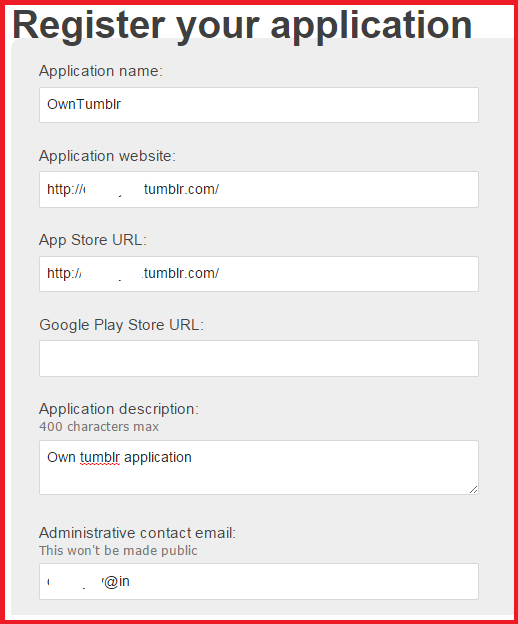
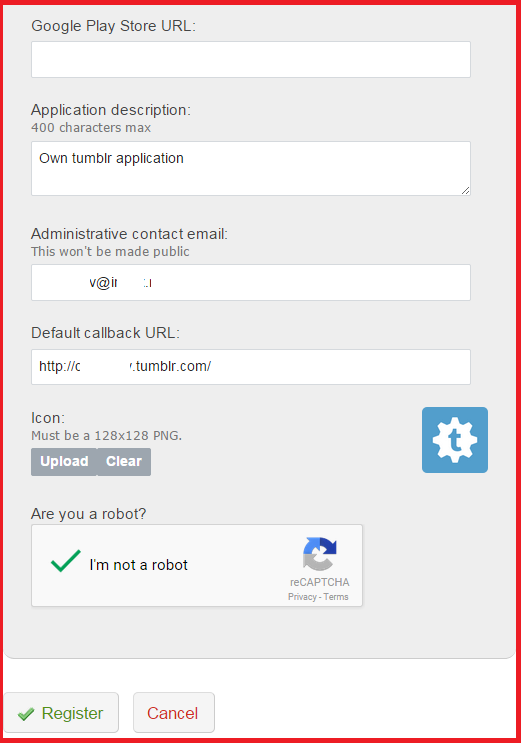
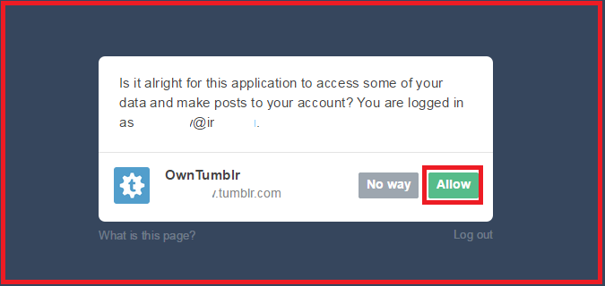
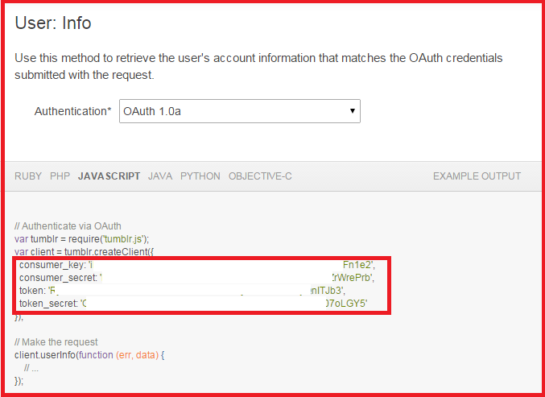

### About 

A simple command line tool that downloads your personal tumlr text blogs in CSV format with optional keyword filter.

### Dependencies

```
pip install pytumblr
pip install pandas
```

### Tumblr Usage

For the basic usage create file ```oauth_info.py``` with following filled Tumblr credentials.

**NOTE** that the *USER_NAME* field should be a full path to YOUR  Tumblr blog without HTTPS/HTTPS.
```
CONSUMER_KEY = ''
CONSUMER_SECRET = ''
ACCESS_TOKEN = ''
ACCESS_TOKEN_SECRET = ''
USER_NAME = ''
```

Check file 'run.bat' for running details or execute script using following command line:
```
python tumblr_blogs.py -o data/tumblr-blog-data.csv
```

### SETUP: How to get OAuth keys in Tumblr

This setup assumes that you are having your own Tumblr account.

#### Register your application



#### How register application with name "OwnTumblr" should look like


#### Click on "Explorer API" and proceed to the Web Interface that can be helfull for you while exploring different API-s of Tumblr 


#### Extract required by this appilcation fields from offered example
```
CONSUMER_KEY = ''
CONSUMER_SECRET = ''
ACCESS_TOKEN = ''
ACCESS_TOKEN_SECRET = ''
```
